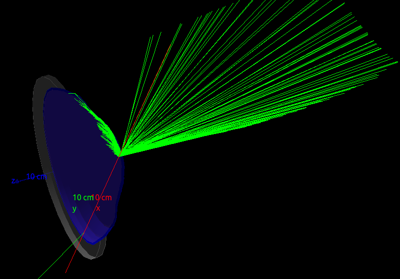

# PMTTeststand
* Contains a box out of air with a PMT inside. The PMT consists of a pyrex glass window, a steel backplate and a sensitive PMT volume out of vacuum fully encapsulated inside.
* Pyrex glass window width can be specified via macro commands.
* Quantum efficiency in `data/` folder will be automatically assigned to the PMT cathode.
* Pre-defined macro commands can be found in `macros/` folder



## How does work

To build the simulation
```bash
mdkir build
cd build
cmake ..
make
```

To run the simulation
```bash
./sim [args]
```

Without argument an interactive session will start. The interactive session will expect a `vis.mac` file to be present in your `build/` folder! Optional arguments are: `-m MacroFileName` will start a batch session that executes the macro specified with `MacroFileName`. Argument `-o Outputfile.extension` will set the name for the Outputfile. Supported extensions are `.csv` or `.root`. Argument `-t nThreads` will check if Multithreading is supported by your G4 installation. If it is, it will start the simulation in MT mode with `nThreads` threads **(MT mode is not tested)**. 